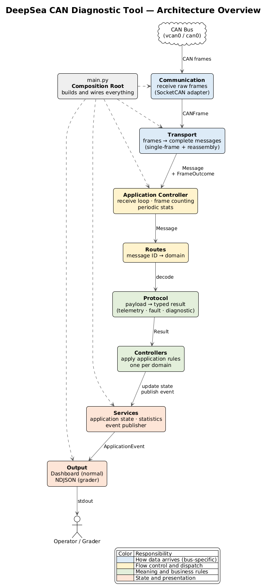

<div align="center">
  <h1>DeepSea CAN Diagnostic Tool</h1>
  <p>
    <strong>Receive-only CAN bus monitor for DC Fast Charger power modules</strong>
  </p>

  <p>
    
    
    
    
    <br>
    
  </p>
</div>

---

## 📢 System Overview

**DeepSea CAN Diagnostic Tool** runs on the main controller of a DC Fast Charger and listens to its internal CAN bus. The charger's enclosure is sealed and live, so field engineers can't inspect the power modules directly. This tool gives them a live view instead.

* 🔋 **Decodes live telemetry**: voltage, current, temperature and status flags (enabled / fault / derated).
* ⚠️ **Reports fault codes**: overtemp, overvoltage, undervoltage and isolation fault.
* 🏷️ **Reassembles identification strings**: serial number and firmware version, sent across several CAN frames using ISO 15765-2-style segmentation.
* 🔇 **Ignores unrelated traffic** on the same bus.
* 🛡️ **Survives a messy bus**: orphan frames, restarted messages, oversized length claims, out-of-order sequence numbers and repeated abandonment, with memory that stays bounded.

> **Constraints:** Python 3 standard library only (`socket` + `struct`). No CAN, ISO-TP or decoding libraries. The tool **never transmits** a CAN frame.

---

## 🚀 Quick Start

### Requirements

* Linux with SocketCAN (developed on a Raspberry Pi 5, aarch64, Raspberry Pi OS)
* Python 3 (no third-party packages)
* A CAN interface, for example the virtual `vcan0`

### Run

```bash
# Normal mode: in-place terminal dashboard
python3 App/src/main.py --iface vcan0

# Grader mode: NDJSON event stream on stdout, logs on stderr
python3 App/src/main.py --iface vcan0 --grader

# Either mode, with debug logging on stderr
python3 App/src/main.py --iface vcan0 --debug
```

Stop with `Ctrl+C` or `SIGTERM`. Both shut down cleanly and emit a final `stats` event.

The tool keeps everything in memory and writes nothing to disk. To keep a grader run, redirect its output: `python3 App/src/main.py --iface vcan0 --grader > run.ndjson`.

### Generate test traffic

In a second terminal, start the challenge's traffic generator. It is used as-is and never modified:

```bash
python3 ~/challenge/can_generator/generator.py --iface vcan0 --duration 90
```

Use a longer duration (for example `600`) to watch memory stay flat over many abandonment cycles.

---

## 🖥️ Output Modes

Both modes consume the **same application events**. Only the presentation changes.

### Normal Mode: Dashboard

An in-place terminal dashboard drawn with plain ANSI cursor codes (no `ncurses`, no UI library). Redraws are throttled so a busy bus doesn't flood the terminal.

```text
DeepSea CAN Diagnostic Tool
------------------------------------------------------------
Module 0:  412.3V  118.55A   47C   enabled=True  fault=False  derated=False  seq=1200
Module 1:  405.1V  120.02A   45C   enabled=True  fault=False  derated=False  seq=1200
Module 2:  399.8V  115.30A   46C   enabled=True  fault=True   derated=False  seq=1200
Module 3:  410.0V  119.87A   44C   enabled=True  fault=False  derated=False  seq=1200
------------------------------------------------------------
Identification strings:
  0x6f0: SN:PMU-4471-A FW:2.3.1 #2392
  0x6f1: SN:PMU-4472-B FW:2.3.1 #2392
  0x6f2: SN:PMU-4473-C FW:2.4.0 #2392
  0x6f3: (not yet received)
------------------------------------------------------------
Recent faults:
  module 2, code 1 (overtemp)
------------------------------------------------------------
Frames processed: 58218
```

### Grader Mode: NDJSON

One JSON object per line on **stdout**, flushed after every line, emitted live as events happen. All diagnostics go to **stderr**.

```json
{"type": "telemetry", "module": 0, "seq": 4821, "voltage": 412.3, "current": 118.55, "temp_c": 47, "enabled": true, "fault": false, "derated": false}
{"type": "fault", "module": 2, "code": 1}
{"type": "diag_complete", "can_id": "0x6f0", "string": "SN:PMU-4471-A FW:2.3.1", "ts_ns": 88123456789}
{"type": "stats", "frames_processed": 15234}
```

`stats` is emitted every second, even when the bus is idle, and once more on shutdown.

---

## 📡 The Bus

| CAN ID | Purpose | Framing |
| :---: | :--- | :--- |
| `0x100`–`0x103` | Module telemetry (module 0–3) | Single frame |
| `0x1F0` | Fault code | Single frame |
| `0x6F0`–`0x6F3` | Identification string (module 0–3) | Segmented: First / Consecutive Frames, at most 64 bytes |
| `0x200`–`0x2FF` | Unrelated noise | Ignored |

---

## 🏗️ Architecture

### Guiding Principle

> **The application cares about messages and their meaning, not about how they physically arrived.**

The system is a pipeline of layers. Each layer has one responsibility and talks to the next through a small, explicit contract. Lower layers know nothing about upper layers. A layer can be replaced (a new bus, a new output format) without touching the others.

<div align="center">
  
</div>

The PlantUML sources live in [`docs/`](./docs): the block overview above, a detailed class diagram of every layer, and the sequence of one frame through the pipeline.

### Layers

```text
┌────────────────────────────────────────────────────────────┐
│ COMMUNICATION        how bytes arrive                      │
│ CommunicationInterface  ◄── SocketCanInterface (vcan0/can0)│
└──────────────────────────────┬─────────────────────────────┘
                               │ CANFrame (id, data, timestamp)
                               ▼
┌────────────────────────────────────────────────────────────┐
│ TRANSPORT            how frames become messages            │
│ Transport  ◄── CanTransport                                │
│   framing map: ID → single-frame | segmented               │
│   SegmentedReassembler: one fixed context per source       │
└───────────┬──────────────────────────────────┬─────────────┘
            │ FrameOutcome (per frame)         │ Message (complete)
            ▼                                  ▼
┌────────────────────────────────────────────────────────────┐
│ APPLICATION CONTROLLER   receive loop · frame accounting   │
└──────────────────────────────┬─────────────────────────────┘
                               │ Message
                               ▼
┌────────────────────────────────────────────────────────────┐
│ ROUTES               which domain handles this ID          │
│ RootRouter ──► SubRouter (telemetry | fault | diagnostic)  │
└──────────────────────────────┬─────────────────────────────┘
                               │ decode, then delegate
                               ▼
┌────────────────────────────────────────────────────────────┐
│ PROTOCOL             what the payload means                │
│ decode_telemetry · decode_fault · decode_diagnostic        │
└──────────────────────────────┬─────────────────────────────┘
                               │ typed result
                               ▼
┌────────────────────────────────────────────────────────────┐
│ CONTROLLERS          what the application does with it     │
│ one per domain → ApplicationState · StatsService           │
└──────────────────────────────┬─────────────────────────────┘
                               │ ApplicationEvent
                               ▼
┌────────────────────────────────────────────────────────────┐
│ SERVICES / OUTPUT    how results are presented             │
│ EventPublisher ──► EventConsumer                           │
│                     ├── Dashboard    (normal mode)         │
│                     └── GraderOutput (grader mode)         │
└────────────────────────────────────────────────────────────┘
```

| Layer | Knows | Does not know |
| :--- | :--- | :--- |
| Communication | How to receive from the medium | Framing, payload meaning, output |
| Transport | How messages are framed on the medium | What a payload means |
| Routes | Which message ID goes to which domain | Payload fields, sockets |
| Protocol | Payload layouts and encodings | Sockets, state, output |
| Controllers | Application rules and state updates | Bytes, rendering, JSON |
| Output | How to present an event | CAN, decoding, reassembly |

### Execution Model

Everything runs in **one thread, one loop**. Each iteration receives at most one frame (with a short timeout), pushes it through the pipeline synchronously, then checks whether a `stats` report is due. Concurrency between modules is *logical*: four independent reassembly contexts let interleaved messages progress side by side without threads, locks or queues. The behavior is deterministic and easy to test.

There is no inter-process communication. Layers communicate through in-process callbacks and return values.

---

## 🧩 Design Patterns

| Pattern | Where | Why |
| :--- | :--- | :--- |
| **Layered architecture** | `communication` → `transport` → `routes` → `protocol` → `controllers` → `services` / `output` | One responsibility per layer, dependencies only point downward |
| **Ports and Adapters** | `CommunicationInterface` ← `SocketCanInterface`; `Transport` ← `CanTransport`; `EventConsumer` ← `Dashboard`, `GraderOutput` | The core depends on abstractions. A UART/SPI bus or a new output is a new adapter, not a rewrite |
| **Composition Root + Dependency Injection** | `main.py` builds and wires every component; sockets, clocks, decoders and controllers are constructor arguments | No hidden globals or singletons. Every dependency can be replaced by a test double |
| **Adapter (anti-corruption)** | `communication/frame.py` turns the kernel's `struct can_frame` into a `CANFrame` | The binary socket layout never leaks past the communication layer |
| **Observer** | `Transport` → `TransportListener` (`ApplicationController`) | The transport announces complete messages without knowing who consumes them |
| **Publish / Subscribe** | `EventPublisher` → `EventConsumer`s | Controllers publish events and never know which output mode is active |
| **Router / Front Controller** | `RootRouter.include_router(SubRouter)`, ID → handler tables, sealed after composition | Dispatch by message ID is declarative. Adding a domain means adding a subrouter |
| **Strategy** | Decoders as injectable functions; output mode chosen at startup; injectable clocks | Behavior is swapped by configuration, not by conditionals |
| **Template Method** | `BaseController` (`handle` + shared `_reject` / `_complete`); `Transport.receive_from` calling abstract `process` | Common flow is written once, domain-specific steps are filled in by subclasses |
| **Finite State Machine** | `ReassemblyContext`: `IDLE` ⇄ `RECEIVING`, explicit transitions | Every bus situation maps to one documented transition |
| **Fixed-size preallocation** | One reassembly context per segmented source, created once and reset in place; `deque(maxlen=N)` for recent faults | Memory is bounded by construction, not by cleanup timing |
| **Result objects** | `FrameOutcome`, `ReassemblyResult`, `DispatchResult`, `ControllerResult` | Expected outcomes (rejected, ignored) are values. Exceptions are reserved for real failures |
| **Immutable value objects** | Frozen dataclasses for frames, messages, decoded results, events and snapshots | Data can be shared between layers without defensive copies or aliasing bugs |
| **Context manager (RAII)** | `CommunicationInterface.__enter__` / `__exit__` | The bus resource is always released |
| **Fault isolation** | `EventPublisher` delivers to every consumer, then raises a single `EventDeliveryError` | One failing output can't silently stop the others |

---

## 🔍 Design Decisions

### Filtering Mechanism

Filtering is done in user space, in one place: the transport's **framing map**. The map lists every supported ID and how it is framed. A frame whose ID is not in the map (noise, or anything undocumented) gets `FrameOutcome.IGNORED` and goes no further.

* **One source of truth.** The same map decides what is accepted, what is reassembled and what is counted.
* **Accounting.** `frames_processed` is incremented in one place, for every frame whose outcome is not `IGNORED`. That includes diagnostic frames that are later rejected (orphan, oversized, out-of-order, abandoned), so the count matches real bus traffic exactly. Noise is never counted.
* **Why user space.** Filtering is scored on correctness, not speed. A single, testable classification point is easier to verify than a split between kernel and application. It also keeps the transport independent of the SocketCAN API, so the same logic works over another bus.

### Reassembly State Management

| Concern | Design |
| :--- | :--- |
| **Keying** | One reassembly context per segmented source ID (`0x6F0`–`0x6F3`). There is no shared buffer, so interleaved messages can't corrupt each other. |
| **Bounding** | The set of contexts is fixed by configuration and created once at startup. Each context holds at most 64 payload bytes. A First Frame claiming more is rejected before anything is stored. |
| **Reset** | A context returns to idle on completion, on an invalid sequence or on rejection. Any new First Frame replaces a message in progress. |
| **Expiry** | No timer is needed for the bound: an abandoned attempt is dropped by the next First Frame on the same ID, and its buffer is released. Memory stays constant however many attempts are abandoned. |

| Bus situation | Behavior |
| :--- | :--- |
| Orphan Consecutive Frame | Ignored, because no message is in progress |
| Restarting First Frame | Old attempt dropped, new one started |
| Oversized length (> 64 bytes) | First Frame rejected |
| Out-of-order sequence number | Attempt abandoned |
| Repeated abandonment | The same fixed context is reused, so memory doesn't grow |

None of these emits a `diag_complete` line, and none affects any other module.

### Error Handling

* **Malformed traffic is normal input**, not an error. It becomes a result value and processing continues.
* **Decoders raise one exception type** (`ProtocolDecodeError`). Routes catch only that type, so a bad payload drops one message, while a programming error still surfaces.
* **Real I/O failures** (`CommunicationError`) stop the tool with a clear message on stderr and exit code 1.
* **stdout is reserved** for program output. Logging always goes to stderr, so debug mode never corrupts the grader stream.

---

## 📂 Repository Structure

```text
📦 Root
 ┣ 📂 App
 ┃ ┣ 📂 src                # Source root
 ┃ ┃ ┣ 📜 main.py          # Composition root: CLI, wiring, lifecycle, signals
 ┃ ┃ ┣ 📂 communication    # Communication port + SocketCAN adapter (receive only)
 ┃ ┃ ┣ 📂 transport        # Transport port, CAN framing, segmented reassembly
 ┃ ┃ ┣ 📂 routes           # Generic routers + per-domain routes (decoder → controller)
 ┃ ┃ ┣ 📂 protocol         # Decoders and result models per domain
 ┃ ┃ ┣ 📂 controllers      # Per-domain controllers + application controller (loop)
 ┃ ┃ ┣ 📂 services         # Event publisher, application state, statistics
 ┃ ┃ ┣ 📂 output           # Dashboard and grader NDJSON adapters
 ┃ ┃ ┣ 📂 models           # Shared models: frame, message, application events
 ┃ ┃ ┗ 📂 config           # Protocol constants and runtime settings
 ┃ ┗ 📂 test               # unit / integration / e2e
 ┣ 📂 Context              # Specs: overview, architecture, standards, workflow, features
 ┣ 📂 docs                 # Debug-mode guide and PlantUML architecture diagrams
 ┣ 📂 images               # Rendered diagrams used by this README
 ┗ 📜 README.md
```

---

## 🧪 Testing

Standard library `unittest` only. No test transmits on a bus.

| Type | Folder | What it checks | Needs |
| :--- | :--- | :--- | :--- |
| Unit | `App/test/unit/<area>/` | One component in isolation | Nothing |
| Integration | `App/test/integration/<boundary>/` | Layers wired together, up to the whole application in both modes, over a fake socket | Nothing |
| End-to-end | `App/test/e2e/<scenario>/` | The live challenge generator on `vcan0`, compared against its own ground truth | Pi with `vcan0` and `~/challenge/` (skipped elsewhere) |

```bash
cd App/src
python3 -m unittest discover -s ../test                         # everything
python3 -m unittest discover -s ../test/unit -t ../test         # one type: unit | integration | e2e
```

pytest is optional and used for development only. It runs the same tests from the repository root:

```bash
python3 -m pip install -r requirements-dev.txt                  # inside a venv
python3 -m pytest                                               # everything
python3 -m pytest App/test/unit/transport                       # one area
```

The end-to-end test runs the generator unmodified for 20 s by default and deletes its temporary ground-truth file afterwards. Override with `DEEPSEA_CAN_IFACE`, `DEEPSEA_GENERATOR` and `DEEPSEA_E2E_DURATION`.

---

## 🗺️ With More Time

* **Kernel filter.** Add `CAN_RAW_FILTER` id/mask pairs in the SocketCAN adapter, so noise never reaches the process. Keep the framing map as the authoritative check.
* **Receive buffer.** Add a bounded, protocol-agnostic FIFO between communication and transport, with an explicit overflow counter. It becomes useful if reception moves to its own thread or a slow consumer appears.
* **Inactivity timeout.** Reset a reassembly context that stops making progress. It isn't needed for the memory bound, but it would stop a stale partial message from lingering on a real bus.
* **More transports.** UART and SPI adapters behind the same communication and transport ports.
* **Soak testing.** Multi-hour runs that record memory and frame counts over time.

---

<div align="center">
  <p>Made with ❤️, ☕, and Python in Colombia</p>
</div>
